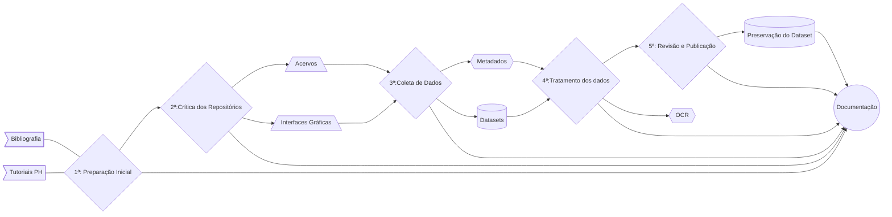

# HEMDIG FRAMEWORK

**Métodos, ferramentas e repositórios digitais em português: um framework para a pesquisa em periódicos digitalizados**

Projeto da pesquisa de pós-doutorado de [Eric Brasil](https://ericbrasiln.github.io) realizada no âmbito do *DH_Lab* (FSCH-NOVA) sob supervisão de Daniel Alves.

Período de realização: **outubro de 2022 a outubro de 2023**

*Resumo*: O objetivo do projeto é analisar a operação historiográfica relacionada ao processo de selecionar, recolher e organizar fontes primárias por meio de ferramentas e dados digitais. Terá como foco repositórios e interfaces gráficas que permitem o acesso a periódicos da imprensa de língua portuguesa digitalizados, com destaque para a Hemeroteca Digital Brasileira e a coleção de periódicos da Biblioteca Nacional Digital de Portugal. Como resultado pretende-se produzir um *framework* (enquadramento dos processos de pesquisa) digital que englobe as etapas da pesquisa histórica para esse tipo de fonte. O *framework* reunirá uma biblioteca de referências bibliográficas; ferramentas para registro metodológico e organização dos dados coletados; documentação e tutoriais dos acervos e suas interfaces gráficas, das ferramentas para reconhecimento ótico de caracteres e reconhecimento automatizado de layout voltados para documentos históricos.

## O framework

- [Projeto completo](https://github.com/ericbrasiln/hemdig-framework/blob/projeto-aprovado/projeto_assinado.pdf)
- [Cronograma](https://github.com/ericbrasiln/hemdig-framework/blob/main/cronograma.md)
- [Bibliografia](bibliografia/README.md)
- [Análise dos repositórios e interfaces de usuário](repositorios/README.md)
- [Ferramentas metodológicas](ferramentas-metodologicas/README.md)
- [Ferramentas de reconhecimento ótico de caracteres](ocr_olr/README.md)

---

 Este repositório está licenciado com uma Licença <a rel="license" href="http://creativecommons.org/licenses/by/4.0/">Creative Commons Atribuição 4.0 Internacional</a>.
