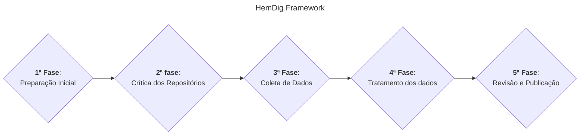

# Diagramas

Esboços de diagramas feitos com mermaid. Os diagramas estão sendo construídos utilizando o editor inline disponível [aqui](https://mermaid.live/).

## Geral (primeiro nível)

## Geral completo

## Pendências

Fazer diagramas específicos para cada fase do framework.