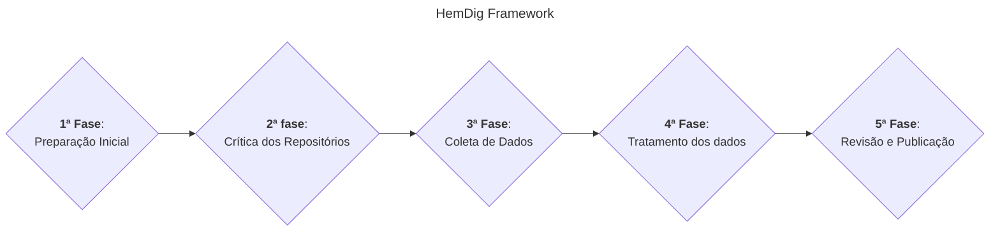
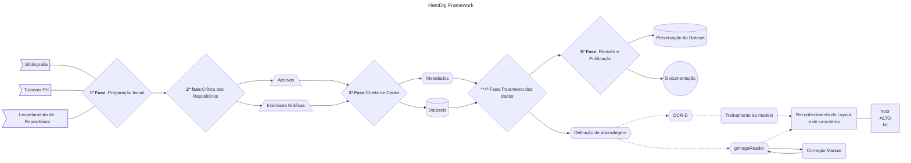
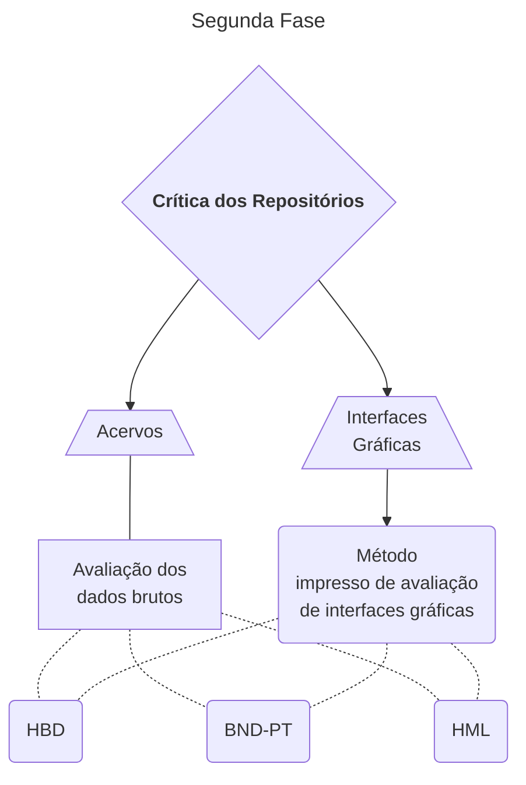
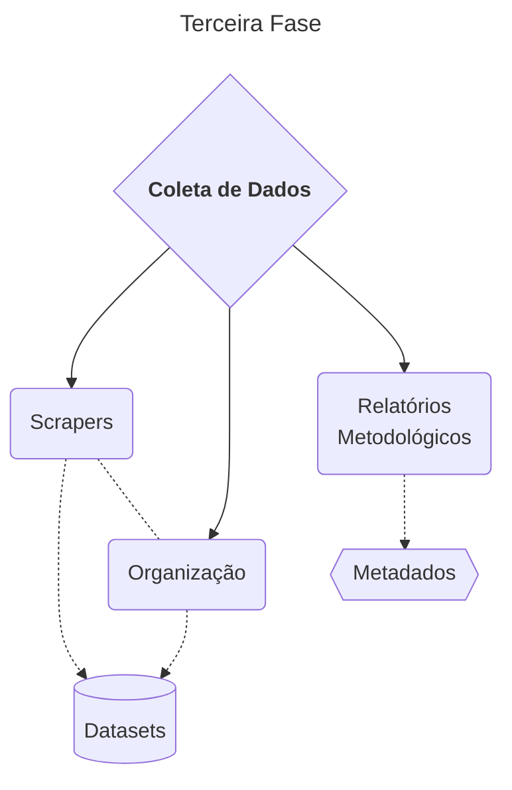

# Diagramas

Esboços de diagramas feitos com mermaid. Os diagramas estão sendo construídos utilizando o editor inline disponível [aqui](https://mermaid.live/).

## Geral (primeiro nível)

## Geral completo

[geral](https://mermaid.live/view#pako:eNpdVFtv2jAU_iuWJSZAQAnXkgckSkqhhcFS9jJSqW5yAtYSGzlOL4vyY6Y9TJq0p_2D8cfmxFzK8pTj7_vOzec4wS73AJu4Wq06TFIZgInGEFp0jUaChPDCxVeH5WihkFBGpYkSB_sBf3E3REgH5_ZGhsGUPEEQZQc-CSJIU5QWCg5z2JGMprbDkPoGSvJYLht_f6ERiaBcNtFCwJYIsvu5-8HRhFGXkuDRwakWXPWv6FNA-VoQn5IHpBJCAw0N-8tYckEJjdBifAZ96k_hmTCp6mCSIw-QDVseUbn7IyiPzrgDZfSRpRNrqMR8ndhQ7H5L6hLk8ehcfspulGtvtLb9rigbnmmUFQRoEav8XV3fSWnlyvHqYuCCeOaR4zy8ByariwmTIHziQoRuxO67r3ycWGP0AU2yKvroWkdvnqIPeQCSZFVbxHuf7nXu-zZJZgr3Miw9Q-5WRYtI5URGpX2gWxXoLgdHOk7rFGcpyLHDqkfeeTDdm2mSWOCr8dH3q3IiT1wQD9YQHoJPUbWmqPMkmQ_tqvXf8SJJ1pOQrMEGJRMHdJ6hyC4uBVB2uudQTXXAS5qz0B7uiza4nG3ApUfelLzxWKrrUf-uGj9XNRuivc7e67R1n0_LcqWGnbtiPzTT5Vz_yVe1Cg_HeEr2uTjkQoAueEZYTIJSDiw06yY3ZquimvxIXf5-9D2O9s0_9F4TPxaLFnfjLHPNLJVwBYcgQkI9tcBJRnaw3EAI2Q462AOfxIFKy2GpohK1JfdvzMWmFDFUcLz1iASLErVT4eFwS9gXzo8meFSt1kw_EflLkVOwmeBXbLYavZpRN-qtZrduGF2jV8Fv2Gz22rW6cdnpdrrt7qXRaKcV_C33Wa_1er1Go9nr1I1Wp9s1muk_OONtMw)

### Segunda fase
    

### Terceira fase

## Pendências

Fazer diagramas específicos para cada fase do framework.