# OCR-D: Tutorial e testes

## Instalação

Explicar a instalação do OCR-D

### Virtual environment e Python 3.7


## Criação do workspace

Após a instalação e ativação do ambiente virtual, precisamos criar um workspace. Com o comando abaixo, informamos ao OCR-D para criar um workspace a partir do diretório `./` (diretório atual e onde estão localizadas as imagens). Com isso, ele criará e configurará um arquivo `mets.xml` onde serão informadas todas os dados e etapas de processamento do workflow.

`ocrd-import --nonnum-ids --ignore --render 300 ./`

## Teste 01: *O Paiz*

### Páginas originais

Vejamos as páginas originais que serão utilizadas para o teste:

1. O Paiz, 05 de maio de 1887, p.2. 


2. O Paiz, 24 de março de 1900, p..


### Workflow testado

O OCR-D reúne uma ampla variedade de ferramentas que podem ser incluídas em um workflow. Para uma lista completa e suas definições, acesse o site do projeto: [https://ocr-d.de/en/workflows](https://ocr-d.de/en/workflows).

Como primeira etapa, ainda como pre-processamento, vamos utilizar ferramentas de melhoria da imagem.

### Conversão para tif

- `ocrd-im6convert -I OCR-D-IMG -O OCR-D-ENH -P output-format image/tiff`

### Preprocessamento com ocrd

- `ocrd-preprocess-image -I OCR-D-ENH -O OCR-D-PREP -P output_feature_added binarized -P command "scribo-cli sauvola-ms-split @INFILE @OUTFILE --enable-negate-output"`

### Normalização da imagem

- `ocrd-skimage-normalize -I OCR-D-PREP -O OCR-D-NORM`

Podemos comparar recortes da imagem original com a imagem processada (convertida para tif e normalizada):

**Imagem 01**


**Imagem 02**


Podemos notar que a diferença ainda é pequena.

### Binarização (Nível de página)

Agora, vamos binarizar as imagens e compará-las com as imagens originais.:

- `ocrd-olena-binarize -I OCR-D-NORM -O OCR-D-BIN`

**Imagem 01**

 

**Imagem 02**

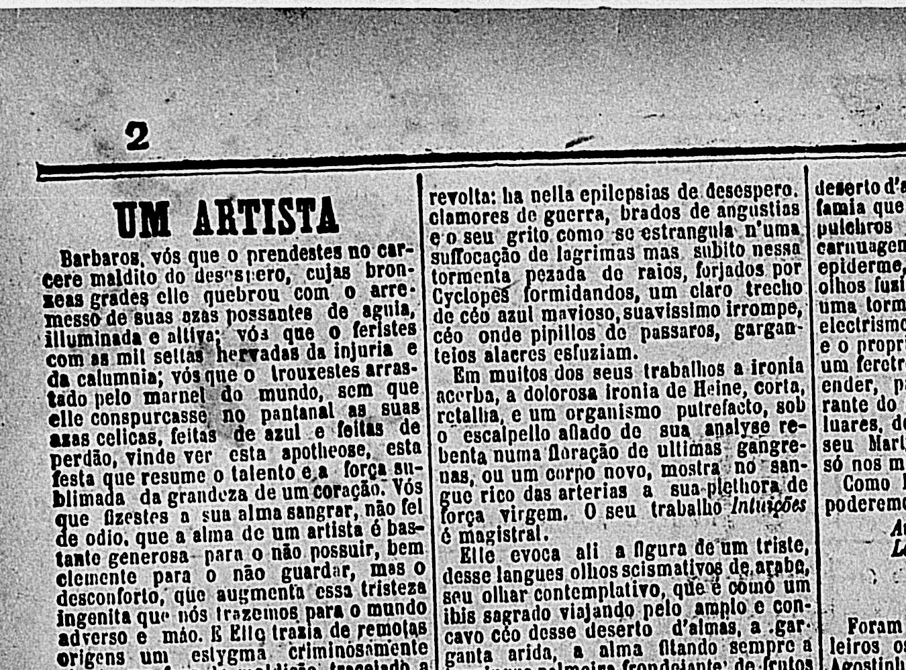 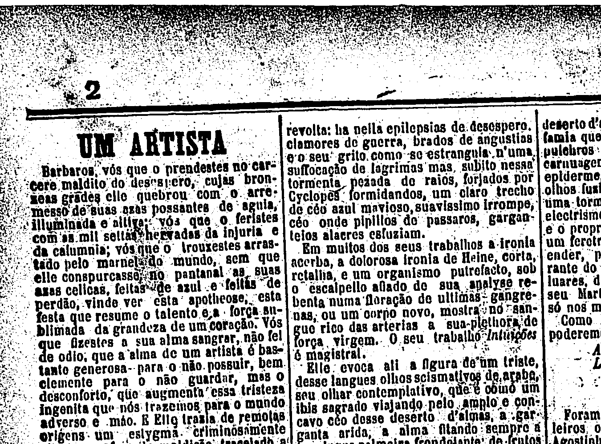

### Redução de ruído

- `ocrd-skimage-denoise -I OCR-D-BIN -O OCR-D-DENOISE`

**Imagem 01**

 

**Imagem 02**

 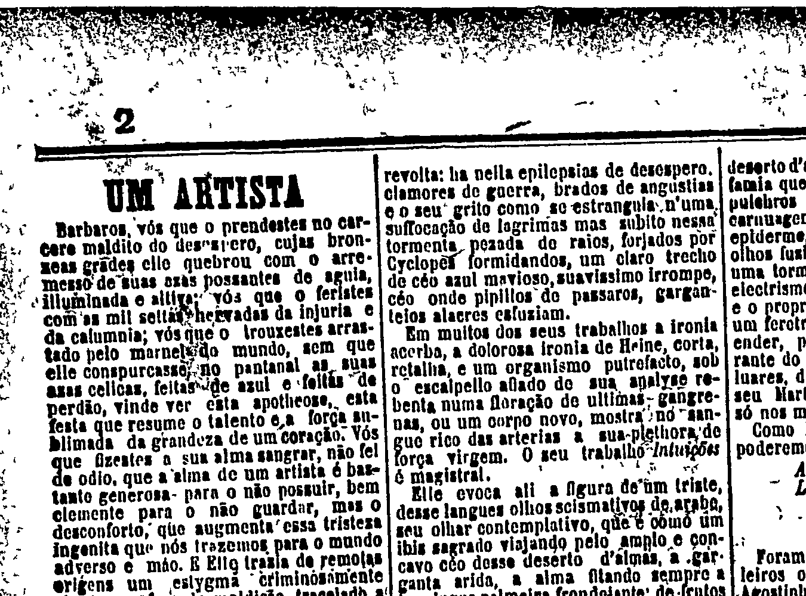

### Deskew

- `ocrd-tesserocr-deskew -I OCR-D-DENOISE -O OCR-D-DESKEW-PAGE -P operation_level page`

**Imagem 01**

 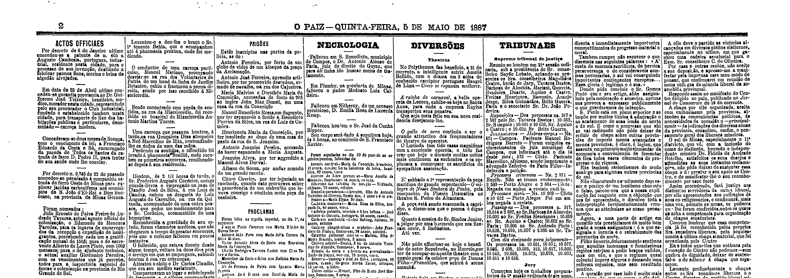

**Imagem 02**

 

### Segmentação

As etapas a seguir buscam segmentar a página em regiões e linhas. Para isso, vamos utilizar o `ocrd-tesserocr-segment` e o `ocrd-tesserocr-segment-region`.

- `ocrd-tesserocr-segment -I OCR-D-DESKEW-PAGE -O OCR-D-SEG -P find_tables false -P shrink_polygons true`

- `ocrd-tesserocr-segment-region -I OCR-D-DESKEW-PAGE -O OCR-D-SEG-REG -P find_tables false -P shrink_polygons true`

Em seguida binarizamos e recortamos as regiões.

- `ocrd-skimage-binarize -I OCR-D-SEG-REG -O OCR-D-BIN-REG -P level-of-operation region`

- `ocrd-cis-ocropy-clip -I OCR-D-BIN-REG -O OCR-D-CLIP-REG -P level-of-operation region`

E por fim, segmentamos as linhas.

- `ocrd-tesserocr-segment-line -I OCR-D-CLIP-REG -O OCR-D-SEG-LINE`

- `ocrd-segment-project -I OCR-D-SEG-LINE -O OCR-D-RESEG -P level-of-operation line`

#### Resultados da segmentação

Os resultados variaram muito entre as duas páginas analisadas. A primeira página, de 1887, apresentou uma boa segmentação de regiões e linhas. Já a segunda página, de 1900, apresentou uma segmentação de regiões e linhas muito ruim. Isso implicará em resultados diferentes para cada página no processo de OCR realizado a seguir.

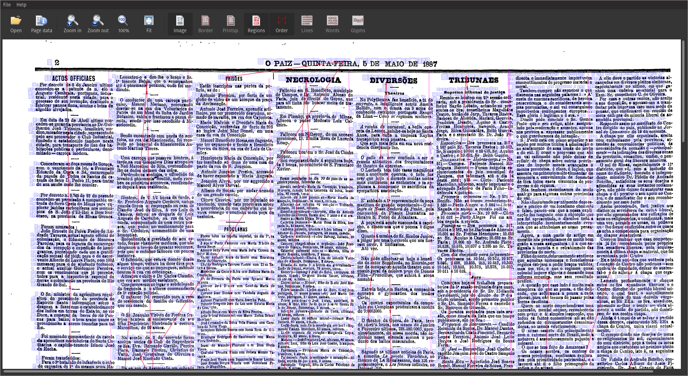

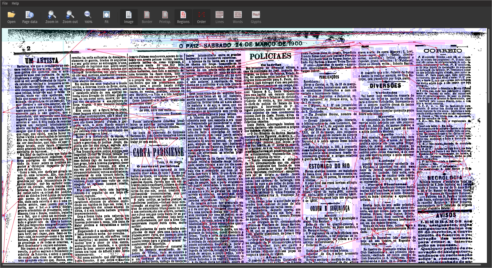

### OCR

#### Calamari

- `ocrd-calamari-recognize -I OCR-D-SEG-LINE -O OCR-D-OCR -P checkpoint_dir qurator-gt4histocr-1.0`
  
Vamos transformar o arquivo xml para texto para facilitar a visualização:

- `ocrd-fileformat-transform -I OCR-D-OCR -O OCR-D-ALTO -P from-to "page text"`

#### Ocropy

- `ocrd-cis-ocropy-recognize -I OCR-D-SEG-LINE -O OCR-D-OCR-OCRO -P model fraktur-jze.pyrnn.gz`

Vamos transformar o arquivo xml para texto para facilitar a visualização:

- `ocrd-fileformat-transform -I OCR-D-OCR-OCRO -O OCR-D-TXT-OCRO -P from-to "page text"`

Os resultados são inutilizáveis.

#### Tesseract

- `TESSDATA_PREFIX=$HOME/src/github/OCR-D/ocrd_all/venv/share/tessdata/`

**Modelo GT4HistOCR_50000000.997_191951**
  
- `ocrd-tesserocr-recognize -I OCR-D-SEG-LINE -O OCR-D-OCR-TES -P model GT4HistOCR_50000000.997_191951`

**Modelo por**

- `ocrd-tesserocr-recognize -I OCR-D-SEG-LINE -O OCR-D-OCR-TES-por -P model por`

Vamos transformar o arquivo xml para texto para facilitar a visualização:

- `ocrd-fileformat-transform -I OCR-D-OCR-TES -O OCR-D-TXT-TES -P from-to "page text"`
- `ocrd-fileformat-transform -I OCR-D-OCR-TES-por -O OCR-D-TXT-TES-por -P from-to "page text"`

#### Comparação 

Melhores resultados obtidos com modelo `por` (português) do Tesseract.

##### Página 1

| Região | Original | Calamari gt4histocr | Ocropy franktur | Tesseract GT4HistOCR | Tesseract por |
| ------ | -------- | ------------------- | --------------- | -------------------- | ------------- |
| 0001   | 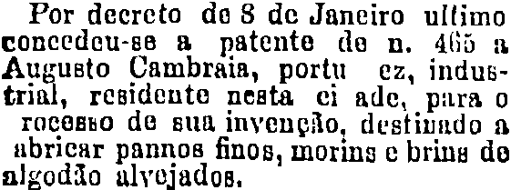 | Por deereto do 8 de Janeiro ultimo toneedeu-ss a patente de n. 4lö a Augusto Cambraia, portu ez, indus- XX XXX X X X.X XXX rocasso de su invenço, destiundo nbrienr pannos finos, morins e brins do nlgodo ulvojados.| Fgx rfgcgxgf(0 Ig F Ig „Zggggggjg jgſfjpgeg 00V0l0U P6  ſ160l170 l0 v. 4iiö uſ, .uzsusko ümrnin, p0rku er, inctgr- ſ FF gFF'„g I ram0zz0 C0 z1u, sm,ggggſg, ſggsſzßgg Zg gg udr0ir Püu009 iuds. worſnz y hrſgg tz gIzggfIg gI,gsgſgg, | Por deereto dsa8S de danoiro ultimo roncodau-gs R patente ds p. 4bon Augusto Lambraia, portu ez. indus— eibegeathee acke plee racasvo do sua invengſo. dostiũndo a abrięar pannos finos, morins e brins do agodão ulvojacdos. | Por decreto de 8 de Janeiro ultimo conccdeu-se a patente de n. dhj q Augusto Cambrais, portu ez, indus- triol, residente nesta ci ade, para 0 rocesso de sua invenção, destinado q ubricar pannos finos, morins ce brins de alcodão alvejados, |
| 0002 | 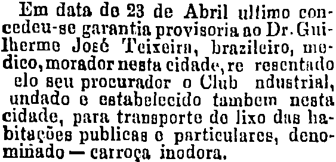 | Em data ds 23 de Abril ultimo coneedeu-se garantin provisoria no Dr. uiIerme oté Teixeirn, brazileiro, modieo, morador nestu eidade. re resentndo elo seu proeurador o Club ndustrinl, undado estaelecido tumbem nesta idude, para transporte do lixo dus habitagöes publicas o pnrtieulares, denominado — earroga inodora. | Sa ügfn, üg PI Zg h-l FF,jl-Z gggg- 9° 6 IIIIB09ki prorisorizna Mr lEui- lh0ra0 üoeé I'eiroiru, hxgzſlgſra, m0- Gi00emoruaruertg oſtnl-.rg rmzentnlo Cl0 üeu prouurncclor o Iuh nVuztrjnl. yCncfg g ggßgfhgjgggſfg jßzgjzz zgeggeg, gIüuu, gnru trunoporte üo liro lnz hm- 9Iydßor gudli.ns q pnrtieuluros, leuo- 9gjIüeg - (gzx0gg, jgggtSgzzg,, | Em data ds 23 de Abril ullimo con—gedeu-se garantia provisoria no Dr. Guiĩ-lermo dõęè Peixsirn,. Prazileiro, mo-dico, morador nosin eidade.re rosentudoelo seu prorurndor o Glub ndustrial.undado s estaboelucido tambem nostaeiduda, parg transports do lixo dus ha-bitaeos publieas pnrticulares, deno-minado — carroęa inodora. | Em data de 23 de Abril ultimo con-cedeu-se garantia provisoria no Dr. Gui-lherme José Teixeira, brazileiro, mo:dico, morador nesta cidade re resentidoelo seu procurador o Club ndustrial,undado 6 estabelecido tambem nestacidade, para transporte do lixo dus ha-bitações publicas 6 particulares, deno-minado — carroça inodora. |
| 0003 | 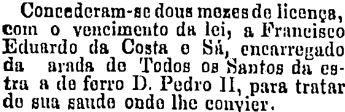 | Contederam- e dous maxssdd licenga, com o veneimento d lei, a Frnneiseo Eduardo da Costa 0 Sd, enenrregudo da arads de Todos os dantos dn estra a de forro D. Pedro JJ, para tratar do su saude ondo lhe convier. | 0ü0kIIm:60 C0l6 k006s l ll0énzn, 00k01 0 1e210ſ00uk0 Iü. I0s, zg, ſ-'xgſgggzjggg FC5“0  C  0hIi0  L kü, enenrreztuclo uuw urnlln üe Ioioz og Zgzzsgg Z„ zz.  f 6 lI9 , “Iüür0 1I, gmrz trntgr eſz gjgz, ggggcg ggſg IIg ccgſ,,- | Vonee deram- xe dous moxes ds licenęn, com o veneimento da lei, a Eraneisco Ecduardo, da. Cogta o Sũ, enoarrogudo da urada da Podos os Bantos da s- tru a ds forro D. Pedro II, para tratar do sun gncds onde Ine convier. | Concederam-se dous mezes de licença, com o vencimento da lei, a Francisco Edurrdo da Costa e Si, encarregado da arada de Todos 08 Santos da es- tra a de forro D. Pedro II, para tratar do gua saude onde lhe convier. |

##### Página 2

Os resultados da página 2 foram muito comprometidos impossibilitando mesmo a comparação entre blocos e texto.

Exemplo de blocos:

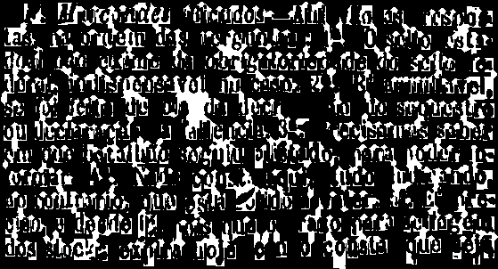

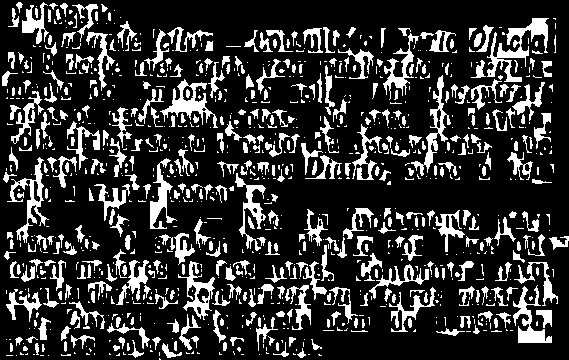

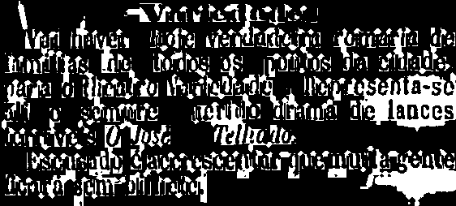

Isso se deve à qualidade da imagem original e da dificuldade de segmentação das regiões de texto, como podemos ver no tópico [Resultados da segmentação](#resultados-da-segmentação).

Abaixo temos uma tabela apresentando os resultados de cada método de OCR para a página 2. Podemos perceber que mesmo o Tesseract-por, modelo com melhor resultado na página 1, não conseguiu reconhecer textos compreensíveis.

| Calamari gt4histocr | Ocropy Frank | Tesseract gt4histocr | Tesseract por |
| ------------------ | ------------- | ------------------- | -------------- |
| boulevardt ouitvardi xtri \thert d fi lron 0 e aul \ss ehnna un bougo. oo e de \Aas pequen; lolport/o.\ \es Forsnuieſꝰ n lgse \⸗ \F i e i \i errciaerX:zr \huiſei ng ſdlũi ũ i eelei \r \l \F  na M \bi uh u b enipn \: lc. ic.cri \kit \ſe e ſ   ſ uu uu o l \k qeu ul i ui s \il \ſc ci och.inn g i \e \ſẽẽſsi llu \h e rrl ſrt \ \ũut \hmr iꝗisif ies uiitcuti \ \ſſ \eiti uuapiseſ \ſitethlailitti iur i \i \ \root \ii \ſiuuieahsi \ſl | „hhgzſz C0ßHsktlt ül \ \„, ggegg,,.., ---- -- - -------- - --- ------ ----.... .. sezulnia GfG° \ \80 n08 l1ék006lV -r916lßllll  \Ig0W .k00skül  - W k0 llbid““ß \I0öékel0s lit0k 1. , - \Zmatg e nols \z jſtz, gzIry Gmal nfella... \ Ggſ,I„9II0 ſz0. \-muuuuuuuhe | boulovard Da bouięurd eIIor \rapoerda dir caron erie ue aqu \a edma vu dbouꝶ. Gonin1e de \mn peguene loae. orlne0. \ \Fed·s. rafeiet, lagee \Iee \Ieẽ Irinee t \eeeeude \Mu .iſ II \ \ \n erE I \een \Fne \ieen \.4E ilais. \Bne ehet \ \ſaüca doiemnne er ini \ \Ie ſ ſMd .E \I Ie \ \icn \Ite ub.I \ \ \Fis t.d \eel⸗ \ee e \ \PE 2 — \. en \Me i. | \boulevards » 0º boutevards catar \à taberna da lis Caron em o ue equi \so chama ur botigo. Comp ago de \RO pequeus Joj porta:só, \ \pop”s, forsteuição n miisido: e 8 \coros,“ enterento pr pedido all, nó Me: \de altos“ ruliptitoãos predio» de cinoé \o ai \Ayumado pon DO APRE \ \ \Fase Pro or araras CR 0d | 

## Teste 02: Boletim de Eugenia

Após o teste com as duas páginas do jornal *O Paiz*, vamos aplicar o mesmo workflow e variados modelos de OCR em um conjunto de 48 páginas do jornal *Boletim de Eugenia* publicano no Rio de Janeiro.

### Páginas originais

Vejamos dois exemplos das páginas originais que serão utilizadas para o teste:

1. Boletim de Eugenia, janeiro de 1929, p.1. 

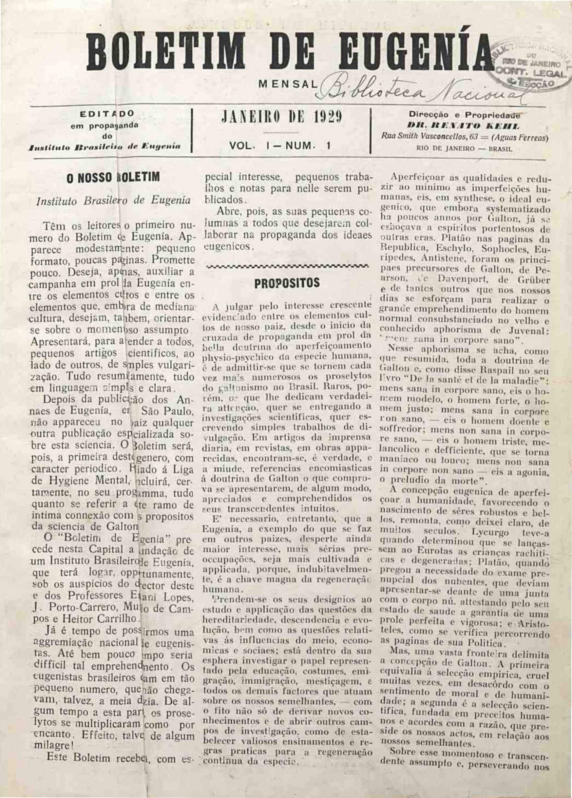

2. Boletim de Eugenia, fevereiro de 1929, p.1.
   
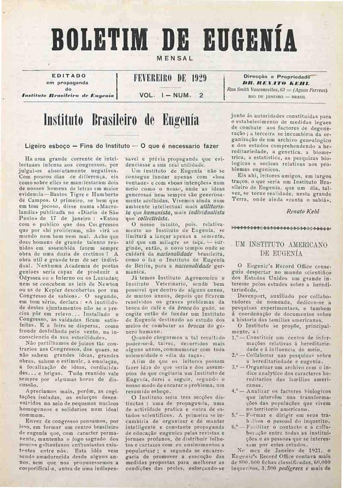

3. Boletim de Eugenia, abril de 1929, p.1.
   
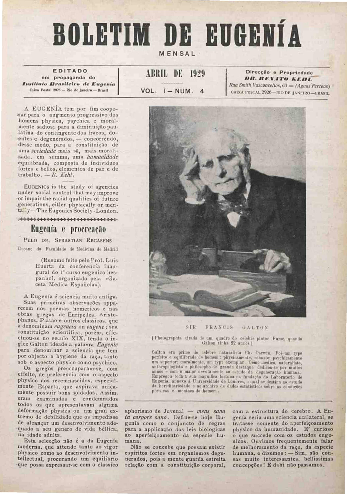


### Workflow testado

Após iniciarmos o ambiente virtual e criarmos o workspace, vamos executar o workflow. Dessa vez vamos utilizar o `ocr-process` e passaremos todas as etapas de pre-processamento e segmentação, como visto no teste anterior com o jornal *O Paiz*.

```bash
ocrd process \
    'im6convert -I OCR-D-IMG -O OCR-D-ENH -P output-format image/tiff' \
    'preprocess-image -I OCR-D-ENH -O OCR-D-PREP -P output_feature_added binarized -P command "scribo-cli sauvola-ms-split @INFILE @OUTFILE --enable-negate-output"' \
    'skimage-normalize -I OCR-D-PREP -O OCR-D-NORM' \
    'olena-binarize -I OCR-D-NORM -O OCR-D-BIN' \
    'skimage-denoise -I OCR-D-BIN -O OCR-D-DENOISE' \
    'tesserocr-deskew -I OCR-D-DENOISE -O OCR-D-DESKEW-PAGE -P operation_level page' \
    'tesserocr-segment -I OCR-D-DESKEW-PAGE -O OCR-D-SEG -P find_tables false -P shrink_polygons true' \
    'tesserocr-segment-region -I OCR-D-DESKEW-PAGE -O OCR-D-SEG-REG -P find_tables false -P shrink_polygons true' \
    'skimage-binarize -I OCR-D-SEG-REG -O OCR-D-BIN-REG -P level-of-operation region' \
    'cis-ocropy-clip -I OCR-D-BIN-REG -O OCR-D-CLIP-REG -P level-of-operation region' \
    'tesserocr-segment-line -I OCR-D-CLIP-REG -O OCR-D-SEG-LINE' \
    'segment-project -I OCR-D-SEG-LINE -O OCR-D-RESEG -P level-of-operation line'
```

### Resultados da segmentação

explicar

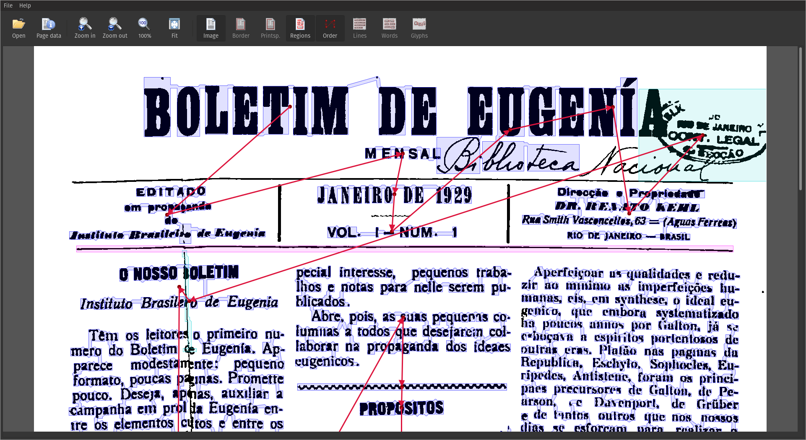

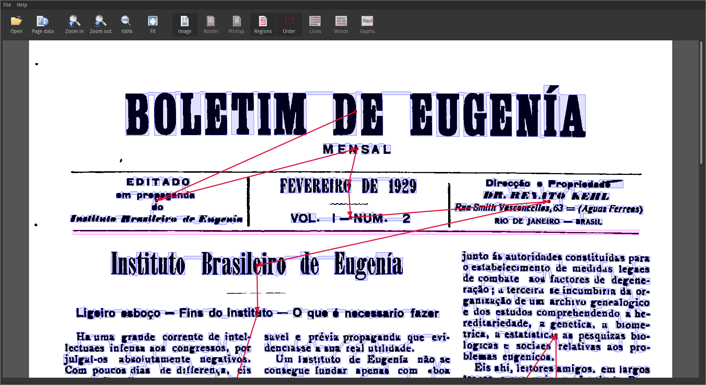

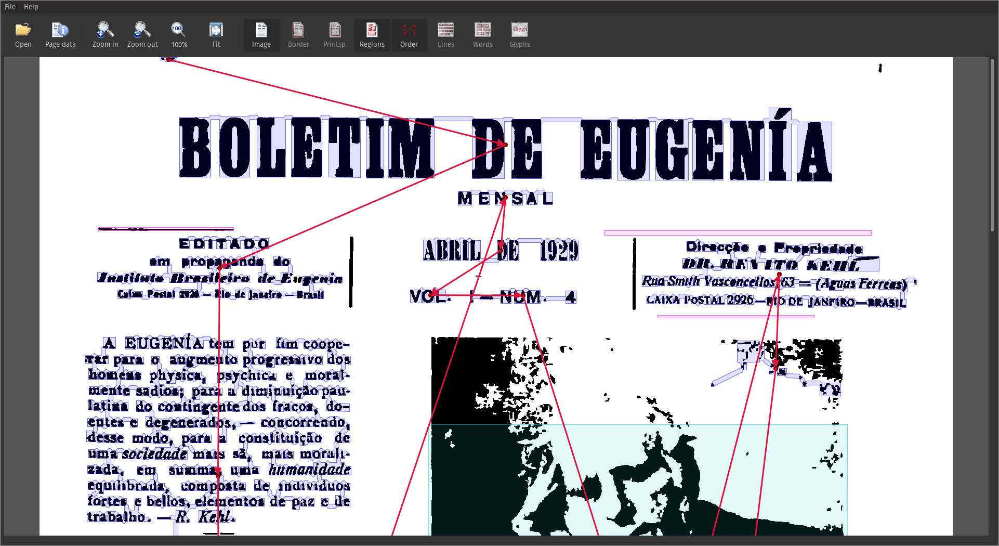

### OCR

#### Calamari

- `ocrd-calamari-recognize -I OCR-D-SEG-LINE -O OCR-D-OCR-CAL -P checkpoint_dir qurator-gt4histocr-1.0`
- `ocrd-fileformat-transform -I OCR-D-OCR-CAL -O OCR-D-TXT-CAL -P from-to "page text"`

#### Tesseract

- `TESSDATA_PREFIX=$HOME/src/github/OCR-D/ocrd_all/venv/share/tessdata/`

**Modelo GT4HistOCR_50000000.997_191951**
  
- `ocrd-tesserocr-recognize -I OCR-D-SEG-LINE -O OCR-D-OCR-TES-GT4 -P model GT4HistOCR_50000000.997_191951`
- `ocrd-fileformat-transform -I OCR-D-OCR-TES-GT4 -O OCR-D-TXT-TES-GT4 -P from-to "page text"`

**Modelo por**

- `ocrd-tesserocr-recognize -I OCR-D-SEG-LINE -O OCR-D-OCR-TES-por -P model por`
- `ocrd-fileformat-transform -I OCR-D-OCR-TES-por -O OCR-D-TXT-TES-por -P from-to "page text"`

#### Comparação 

##### Página 1

| Região | Original | Calamari gt4histocr | Tesseract GT4HistOCR | Tesseract por |
| ------ | -------- | ------------------- | -------------------- | ------------- |
| 0012   | 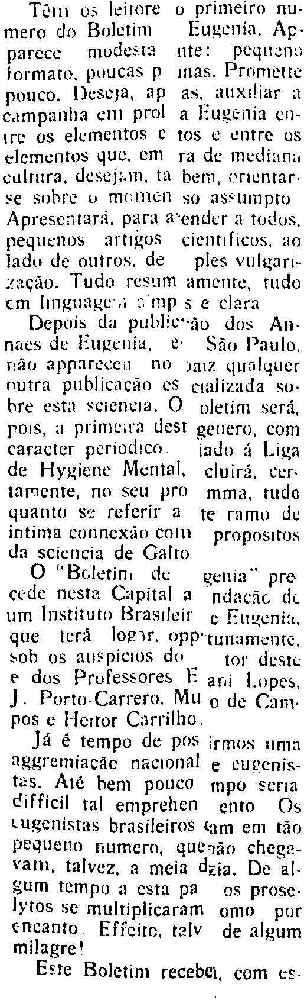 | Tẽn os leitore o primeiro nu— mero cdh Boletim Eugenia. Ap- parece modesta nte:pequeno formato. poucas p nas. Promette pouco. Deseja, as, auxliar a campanha en prol a Eugcnia en— lre os elementos c tos entre os elementos que. em ra de mediunn cultura. desejum. ta hem, orientar. e 0 mqUclt s0 asllmpto Apresentara, para a ender a todos, pequenos artiſos cientrfieos, 30 lado de outros. de ples vulgari- aão. Tudo resum amente, tudo em lmguae'n Jimps e clara Depois da publictão dos An— naes de Euenia. e So Paulo. riã appprecee o aiz qualquer outra publicacão es cializada so bre esta sciencia. O oletim sera pois, a primeira dest genero, com caracter periodico. iado â liga de Hyiene Mental. cluira. cer lamente, no seu pſ0 mma, tudo quanto se referir a te ramo de intima connexão coi propositos da sciencia de Calto O Bcletin de genia'' pre cede nesta Capital a ndacãc de um lnstituto rasileir e Eugenia. que tera logar. opp'tunamentc. oh os allspicts do tor deste e dos Professores E ani l.opes. . Porto- Carrero. Mu o de Cam pos e leitor Carrilho. a é tempo de po irmos uma gremiacae nacional e eugenis- tes. Aie bem pouco mpo seria difficil tal emprehen ento Os ugenistas brasileiros am em tão ſequeno numero, quenão chega- vam, talvez, a meia dria. De al— um tempo a esta pa os prose- lytos se multiplicaram omo por encanto Effeite, telv de algum milagre! Este oletim recebei, com s | Tém os leitore o primeico nu— mero do Boletim Fugenia. Ap- parece modesta nte: pequenò formato. poucas p inas. Promette pouco. Nese)a. aß as.. àAlxi iar 2 campanha eni prol a Fusenia en— tre os elementos c tos e entre os elementos que. em ra de mediuni cultura. desejm. ta hem, orientar. se sobhre mœinen so assumpto Apresentara. para aender a todos. pequenos artigos cientificos. 20 lado de outros. de ples vulgari- zacaão. Tuda resum amente, tucdo em linguagein mps e clara Depois da publieao dos An: nues de Euxenia. e São Paulo. ſã⸗ apparecen no zaiz qualquer tutra publicacäo es cializada so: bre esta scieneia. Q oletim serä, pois, a primeira dest genero. com caracter periodico. jado à liga de Hygiene Mental. cluira. cer. lamente,. no seu pr0 mma,. tudo quanto se referir a te ramo de intima connexão comn propositos da scieneia de Galto O Boletinn de cenia pre cede nesta Capital a ndacãc de um Instituto Brasileir e Fugenia. que terà lopar. opptunamiente. dob os auspicios de tor deste e dos Professores E ani l.opes. J. Porto-Carrero. Mu o de Cam pos e Heitor Carrilho. Jaà è tempo de pos irmos uma aggremiacãc nacional e vugenis— tes. Aiè bem pouco mpo Serta gifficil tal emprenen ento Os Lugenistas brasileiros cam em tão Pequeno numero. queaão chega-— val, talve2. a meia daia. De al- um tempo a esta Pa os prose⸗ lytos se multiplicaram omò por cnanto, Effeito. talv de algum milagre! Este Boletim recebej. com es: | Tém os leitore o primeiro nu- mero do Boletim Eugenia. Ap- parece modesta nte: pequeno formato, poucas p inas. Promette pouco. Deseja, ap as, atxtiar a campanha em prol a Eugenia en- re os elementos C tos u entre os elementos que. em ra de mediuni cultura, desejam, ta bem, crentar- se sobre o mMemen so assumpto Apresentara. para aender a todos, pequenos artigos científicos, ao lado de outros, de — ples vulgari- «ação. Tudo resum amente, tudo em linguages cmpse clara Depois da publiccão dos An: naes de Eugenia, e São Paulo, não apparecei No vaz qualquer nutra publicação cs cializada so- bre esta sciencia. O oletim será, pois, 4 primeira dest genero, com caracter periodico. ado á Liga de Hygiene Mental, cluirá, cer lamente, no seu pro mma, tudo quanto se referir a te ramo dx intima connexão Com propositos da sciencia de Galto O “Boletim de  genia” pre cede nesta Capital a ndacãc di um Instituto Brasileir q Etvenia. que terá logar. opp-tunamente, sob os auspícios do tor deste e dos Professores E ani Lopes, J. Porto-Carrero, Mu 9 de Cam. pos e Heitor Carrilho. Já é tempo de pos irmos uma ngeremiação nacional e cugenis- tas. Até bem pouco mpo seria Cifficil tal emprehen ento Os Lugenistas brasileiros Gm em tão pequeno numero, quênão chega- vam, talvez, a meia dzia. De al- sum tempo a esta pa os prose- lytos se multiplicaram omo por encanto. Eficito, talv de algum milagre! Este Boletim recebe, com cs. |

##### Página 2

| Região | Original | Calamari gt4histocr | Tesseract GT4HistOCR | Tesseract por |
| ------ | -------- | ------------------- | -------------------- | ------------- |
| 0007   |  | lulilil hraileiro le lugenin | ſnztitlltg hrasileirg de hugenin | Instituto brasileiro de Eugenia |
| 0008   |  | igeiro esboco — Fins do lnstituto O que é necessario faer | Uigeiro esboco — Fins do Instituto - Oque è necessario fazer | Ligeiro esboço — Fins do Instituto - O que é necessario fazer |
| 0009   | 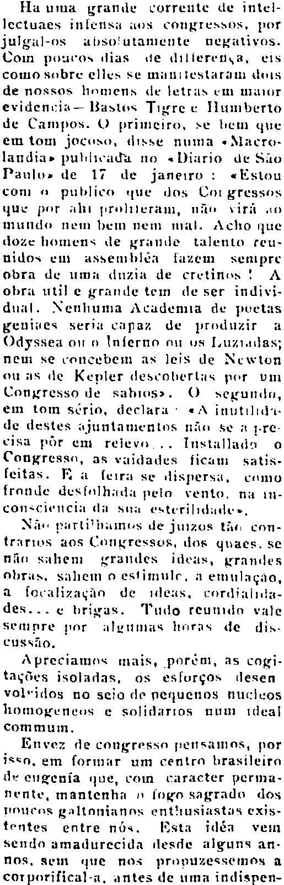 | HL um urande corrente de intel— lectuaes inlens t onnesss, por julgul-os atsoutamente negativos. Coin po:tas lias de dſhlereta, e1s coii bre elle e mttzesUtai ks de nossas limens de lettemi art evidencia — atos igre e HIumberto de ampos. priieiro, e be ut em tom joceiso, diss numa ncro- landia- puklacaa no iario d ũo Paulo- de 1 de janeiro: s1ou conm  publico iue os t t gssss i or i pirolrerami, nſu irã ,et tn Ichr nemhht nem n1a, Acho ue toc otnens de talento teu- nidos em aseurblen fzem enipre bra de mm lzin de eretines A obr util e grande tem de ser indivi- dual. Neniuma Aademia de puetas geuiues eri pan de produzir A Odysse oiſg lnſerno ou us I,uzias nem se cncebem leis de Neton ou 11 e epler leseohern por vm Conresso e aahis. eunes, em tom ério, declar Anutilſit- tle destes jtnlamentos n ze . r- cisa por em releve,,,. Installi onress, as vidades fica satis- feitas. ſ rr se disperst, cimo lrade ds fſhhdd pel vento, na rn— Cons eIICCli tW iin etin esterihrztl—- N ari hemos de juzs th con- lrirnr o il es. Se n sahen ranees nhra s. sheem o esſimul en emuln emulnoo aſocaliznco de les, ordilik- des. rigas. ulo reunka vle eturnire pior nhgtinras hnrns de di us ̃0. Apreciame mais, porm, as coggi- taAes isoladns, os eslorqos lesen volilos no seio cle nquenos uthos oiio gu neeſs e olitartos uum tdeal Commum. n vez de congrsc pensa1s, or is em ſoriar um centr lrasileira d eitgenia que, ccm aaracter perma- nente, mantenh lor sagrad dos tiuess nlUnianqs entkiusiastas exjs- tentes entre no. jdẽn vein nd amalurecid ilesle alguns an- is, un tI n ronuuzssmos a cor porifical-t. antes de uma indispen- | Ha uma Urande correute de intel— lectuaes intensu i congrex»dos. Por julgul-s asotutamente negativos. Com puas lias de dilierensa. eis comOsbre elles Se munitestatum urs de nossos Homens de letrixeu muir eidennia — Badtos Tigrer IIumberto ae Campos. primeito, xex bem que em tom joccdο. disse numa -Mero- landia- putiicada no -Diario dòe Suio lanlode 17 de janeiro: „Esiou conAa puhblic ue das Got gressos ijue por ahi firolieram, nũ vira a muncde nem bem nem mia. *cho que doze homens de grande talento teu— nidos em asSenihléa luzem senipre obra de umn duzia de cretin! A obrui utihe grande tem de ser indiri— dual. Nenhuma Academia de puetas geniues serin npa de produzir 2 (dyssea Oo inierno ou s LuzasS nem se eonecubvem a8leis de Newton u IsSde Fepler descoherlns per vm Conxresso de sahiosx. ) sexunda, em tom sério. declara A inutilida— de destes njuntamæntos ni Se a jere- cisa pör em reiev. . . InstaIIna o Congressn, as viidades fican satis— ſeitas. Ra ſeira se disnersus,. cmo krande deslIhid neta vento, na in— conscieucin dn su esteriſichitdee. Ne parlinimi-S de jiiazs tũs con— trarios aos CangressoE. OS quaes. se nũi sahenn Lrandes ideus, Erandes abrud. Sahem o estimulc. a emulacao. a ſocaliazaso de ideis. cordinirin-— des. .. e hrigas. Fudo reunrda val]e semnre ſor umus« hrras de dis— Cussao. Apreciama mais, poréem, as catri-— tagũes isoladas, os esloręos desen volridos no seio de pequenos nuclvos omogęneis e soſidarros num rdeal COmmum. Unvez de congressa pensamas, por ise. em formar um centra brasileira d5 engenia que, cain caracter perma- nente. mantenhi fgo sagrada dos ſoues galtonianos entnusiistos exis- tentes eatre na. Esta idéa vein senda amauurecida desde aIguns an- nos. Sem e nos prinuazesSemmos a corporifical-. antes de uma indispen— | Ha uma grande corrente de intel- lectuaes intensa aos congressos, por julgul-os absolutamente negativos. Com pouvos dias de dilferença, eis como sobre clles «e munitestaram aus de nossos homens de letras cin muor evidencia— Bastos Tigre cv Humberto de Campos. O primeiro, se bem que em tom joceso, disse numa «Macro- landia» publicada no «Diario de São Paulo» de 17 de janeiro : «Estou com o publico que dos Cor gressos que por ali prolmeram, nie virá «o mundo nem bem nem mai. Acho gue doze bomens de grando talento reu- nidos em assemblea fazem sempre obra de uma duzia de cretinos ! A obra util e grande tem de ser indivi- dual. Nenhuma Academia de poetas gentues seria capaz de produzir a Odyssea omo Inferno ow os Luziadas: nem se coticebem as leis de Nuwton ou as de Kepler descobertas por um Congresso de sabios2. O segundo, em tom sério, declara * «A inutilida- de destes ajuntamentos não se a pre visa pôr em relevo... Instalado o Congresso, as vaidades ficam satis- leitas. Poa feira se dispersa, como tronde destoalhadoa pelo vento, na n- consciencia da sus esterilidade. Nato partUlhamos de Juzos tãe con- trarios vos Congressos, dos quaes. se não sabem grandes ideas, grandes Abram. sahem o estimulo. a emulação, a focalização de ideas, cordialnia- des... « brigas. Tudo reunido vale sempre por aluimas horas de dis. CUSSÃO., Apreciamos mais, porem, as copi- tações isoladas, os esforços desen volridos no seio de penuenos nucleos homogveneos e solidarios uvum ideal commmuim. Envez de congresso pensamos, por isen, em formar um centro brasileiro d» eugenia que, com caracter perma- nente, mantenha o fogo sagrado dos poucos galtonianos entitusiantas exis- tentes entre nós, Iosta tdéa vem sendo amadurecida desde alguns an. nos, sem que nos propuzessemos a corporifical-a, antes de uma indispen- |

##### Página 3

| Região | Original | Calamari gt4histocr | Tesseract GT4HistOCR | Tesseract por |
| ------ | -------- | ------------------- | -------------------- | ------------- |
| 0001   |  | IlMnMfitſiſiini | ſſſſff. | OST DEU ICN |
| 0003   |  | E A0 em propngandn d0 t ittif— t ateri . piiii lnix Ptn! in ele ancitn utnail | 1211IIee om propnganda dgo FiiI Iαιαοi05 06 E7α ιi ſixA Hc5t! Z — Kin ie laneitrn ictnril | - REM TRARENO) em propaganda do Frntituto Ebreasiteiro de E quente Eniao Postal 20 — Rio de Janciro  mennil |
| 0004   | 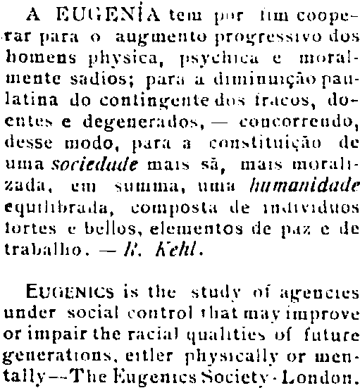 | A l. ENN A tem pur Jim coope— ra 0 al miezto pretesstvo dlos homens phsica, ſihſcu t mréral— iente sudios; pur z Itiuur al— latina do contingente ds iracos, do— entus e degenerrlos, — ceucorrendo, lesSe modo, aar insttuicãu de Uii ciecltle ma1s S, ma1s mral— Zali, u utima, Uutlz ſlitiidacſe eqtlihrila, tposl le n lnedos lortes bellos, eletuentos ile pa e trahnllio. — '. Aeſil. E(iNlCs is te tud i ſeuc1es under ocial control llat mn iiimprove or impair the racial qualltis oſ ſutute geuernttuns, etler pihsrcall or men- tally ne lugenies ociet- London. | A ElFNia tem pt liu coope— rar ſiiraO auxęmento praoteSS1voO dos homens phxsica, ſisxehicue moral- mente sadios; puri diminuięo pau- latina do contingente dus iracos, do— entoed e degeneritos,. — cuncorrendo. desse modo. Pari canxtituieũo de uma Socicilitle mai8 sS, muis morali- zudi. em suuima. uui ſiiimuniditie equtlihrudu, roiipost de nairditos tortes e bellos, elementos de paz e de tralilli0. — . Aeti. EuciN1e8is te studx o ageuetes under social control hat max improve or impair the racia] qualities oſ futuce Feueratiauns. eitler ſhysicallx or men- tallv -The Fugenies Bocietx -l-ondon. | A BEUGENTA tem por dim coope- far pira O aumento progressivo dos homens physica, psychica e moral mente sadios, para a dimumção pau- latina do contingente dos irácos, do- ecntes e degenerados, — concorreudo, desse modo, para a constituição de uma Soriedude mais sã, mais moral cuda, um sutmima, uma Aumantdade equilibrada, composta de ainividios lortes e bellos, elementos de paz e de trabalho. — 4 Acht. EVGENICS às the study ot agencies under social control that may improve or impair the racial qualities of future generations, estler physically or men- taily-—— The Bugenics Society - London. |

## Recomendações

- Qualidade da digitalização afeta muito o resultado, impossibilitando a comparação entre blocos e texto.
- Realizar esse trabalho individualmente se torna inviável, pelo alto consumo de tempo, mas também pela demanda de conhecimento técnico, e de recursos computacionais.
- As ferramentas do OCR-D são muito valiosas para preprocessar as imagens, realizar a binarização, normalização, redução de ruídos, curvaturas e abaulamentos nas imagens.
- Ainda é marcante a dificuldade em reconhecimento do layout da página, e a segmentação de blocos de texto quando as imagens digitalizadas não apresentam uma qualidade elevada.
- Ainda assim notamos um resultado satisfatório quando combinamos digitalizações de páginas de boa qualidade, o OCR-D para preprocessar as imagens e o Tesseract para realizar o reconhecimento do layout e de texto com o modelo `por`.
- Entretanto, para resultados mais precisos, fica evidente a necessidade de treinar um modelo específico para o layout e texto.
- Para trabalhos cotidianos de pesquisa, onde historiadores lidam com algumas centenas de páginas de jornais digitalizados, acredito que seja mais proveitoso uma combinação entre OCR-D e o gImageReader[^gimagereader]. O OCR-D para realizar a binarização, normalização, redução de ruídos, curvaturas e abaulamentos nas imagens, e o gImageReader para realizar o reconhecimento do layout e de texto, assim como a revisão final do OCR.
  
[^gimagereader]: Ver tutorial neste mesmo livro.