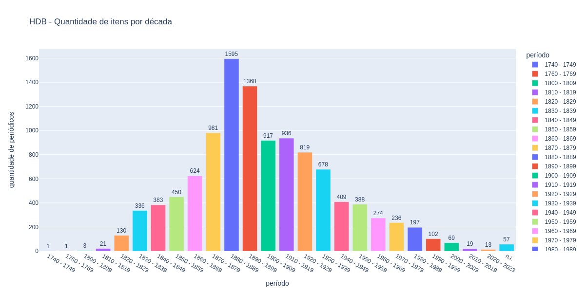

# Escopo geral da HDB

A Hemeroteca Digital Brasileira da Biblioteca Nacional, não disponibiliza em seu sítio web os dados gerais do acervo digitalizado. Assim, realizei análise manual na interface gráfica de busca no dia 01 de junho de 2023, buscando o escopo geral dos dados disponíveis.

Inicialmente, inseri o parâmetro <Período> e o primeiro recorde temporal disponível: <1740 - 1779>. Um único item para <Local>: *Lisboa, POR* e um <Periódico>: *Folheto de Lisboa : Entre Douro e Minho (Lisboa, POR)*. O príodo seguinte, 1760 - 1769, também possui um periódico de Lisboa, o *Hebdomadario Lisbonense (Lisboa, POR)*. 

O último item no parâmetro período é <2020 - 2023>, onde encontramos periódicos do Rio de Janeiro (3), São Paulo (3) e Santa Catarina (7).

| Período | Local | Periódico |
| ------- | ----- | --------- |
| 1740 - 1779 | Lisboa, POR |  Folheto de Lisboa : Entre Douro e Minho (Lisboa, POR) |
| 1760 - 1769 | Lisboa, POR |  Hebdomadario Lisbonense (Lisboa, POR) |
| 2020 - 2023 | RJ | Conjuntura Econômica (RJ) |
| 2020 - 2023 | RJ | Revista do Instituto Histórico e Geographico do Brazil (RJ) |
| 2020 - 2023 | RJ | Revista Saúde em Debate (RJ) |
| 2020 - 2023 | SP | A Tribuna (SP) |
| 2020 - 2023 | SP | AT Revista (SP) |
| 2020 - 2023 | SP | Jornal do Boqueirão (SP) |
| 2020 - 2023 | SC | Cooperalfa (SC) |
| 2020 - 2023 | SC | Correio do Norte (SC) |
| 2020 - 2023 | SC | Cruzeiro do Vale (SC) |
| 2020 - 2023 | SC | Folha de Coqueiros (SC) |
| 2020 - 2023 | SC | Jornal do Zinga (SC) |
| 2020 - 2023 | SC | Jornal Metas (SC) |
| 2020 - 2023 | SC | Revista do CEMJ (SC) |

## Quantidades de periódicos por década

O acesso aos dados dos periódicos disponibilizados pela interface da HDB não se dá de forma estruturada, como no caso da BNP-PT. No caso da BND-PT, conseguimos acessar um ficheiro csv com os dados completos de todos os periódicos digitalizados, contando com informações como local de publicação, ano, editora, idioma, entre outros (ver [análise dos dados aqui](../BND-PT/pandas/analise_bnp.ipynb)).  

Para construirmos um dataset nesse mesmo modelo para o acervo da HDB, precisaríamos ou da disponibilização diretamente pela Fundação Biblioteca Nacional,[1] ou da criação de um scrapper para acessar a interface gráfica e coletar os dados. Esse objetivo não está no escopo da pesquisa, mas podemos realizar uma análise manual dos dados disponíveis na interface gráfica. Foram registrados a quantidade de periódicos por década, e a quantidade de periódicos por local de publicação. Essa estratégia busca apenas um panorama geral do acervo, sem aprofundamento na análise dos dados.

[1]: Realizei contato com *Setor de Gestão de Programas e Inovação - SGPI/BNDigital* solicitando informações sobre o acesso a esses dados.

| Período     |Quantidade de locais | Quantidade de periódicos |
| ----------- | ------------------- | ------------------------ |
| 1740 - 1749 | 1  | 1    |   
| 1760 - 1769 | 1  | 1    |
| 1800 - 1809 | 2  | 3    |
| 1810 - 1819 | 8  | 21   |
| 1820 - 1829 | 14 | 130  |
| 1830 - 1839 | 22 | 336  |
| 1840 - 1849 | 21 | 383  |
| 1850 - 1859 | 25 | 450  |
| 1860 - 1869 | 27 | 624  |
| 1870 - 1879 | 28 | 981  |
| 1880 - 1889 | 28 | 1595 |
| 1890 - 1899 | 27 | 1368 |
| 1900 - 1909 | 28 | 917  |
| 1910 - 1919 | 32 | 936  |
| 1920 - 1929 | 29 | 819  |
| 1930 - 1939 | 28 | 678  |
| 1940 - 1949 | 28 | 409  |
| 1950 - 1959 | 27 | 388  |
| 1960 - 1969 | 20 | 274  |
| 1970 - 1979 | 19 | 236  |
| 1980 - 1989 | 20 | 197  |
| 1990 - 1999 | 13 | 102  |
| 2000 - 2009 | 10 | 69   |
| 2010 - 2019 | 5  | 19   |
| 2020 - 2023 | 3  | 13   |
| n.i.        | 14 | 57   |

